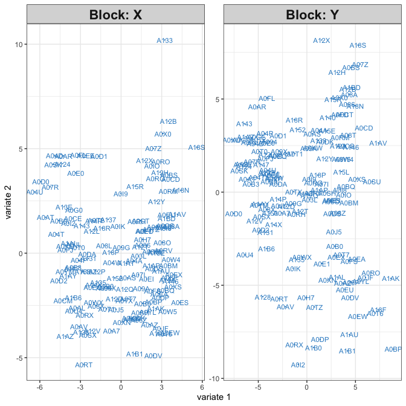
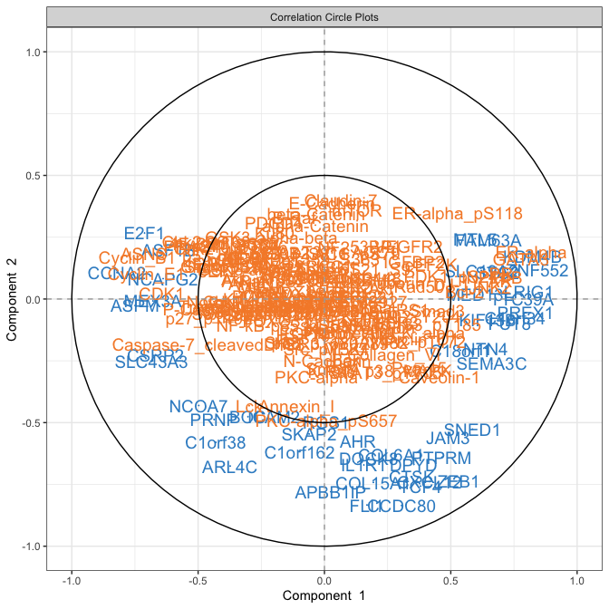
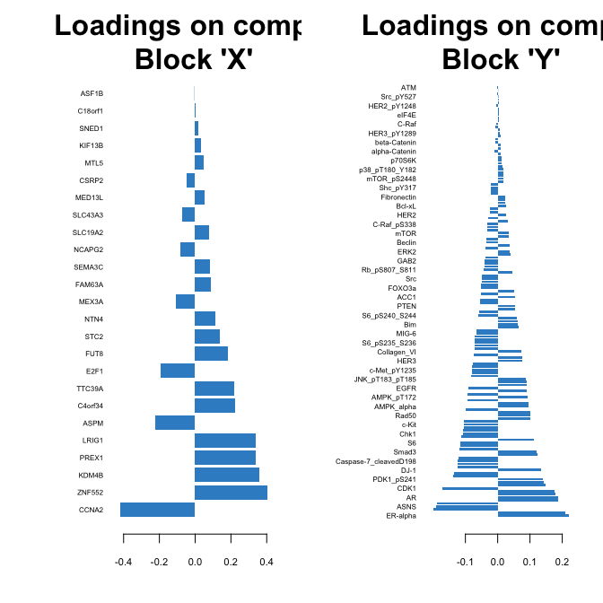
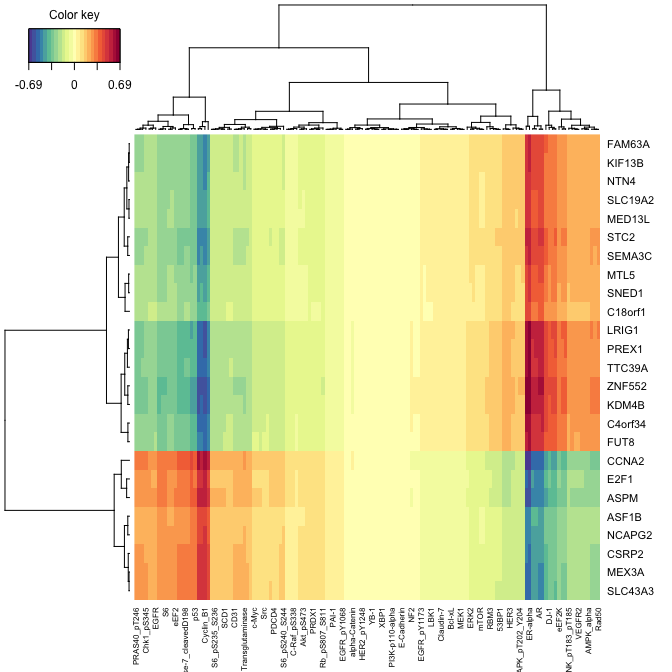
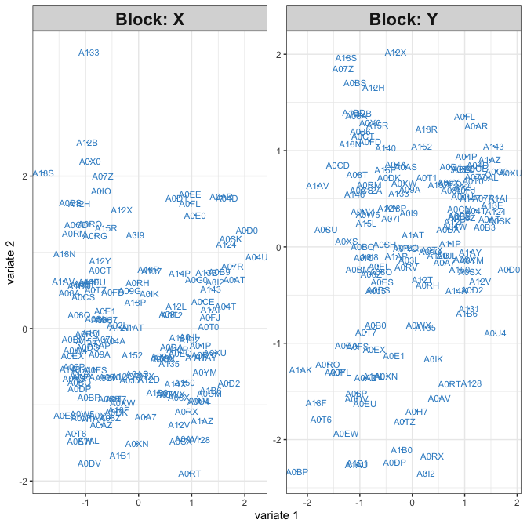
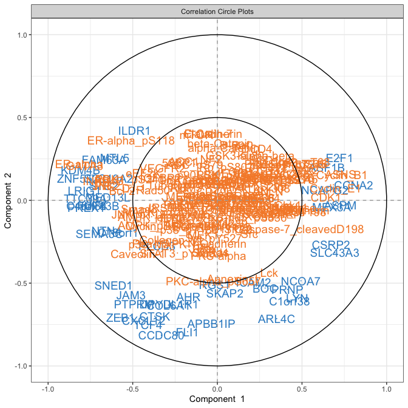
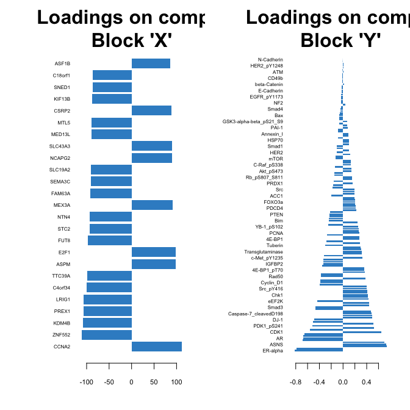
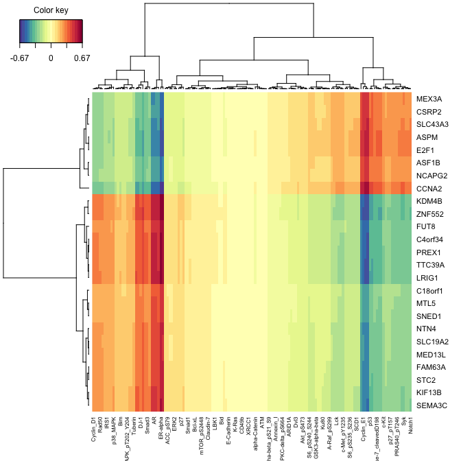

RDA & PLS
================

``` r
suppressMessages({
    library(mixOmics)
    library(microbenchmark)
    library(parallel)
    library(elasticnet)
    library(Rfast)
    library(parallel)
})
```

``` r
sourceCpp("../src/utils/test.cpp")
```

    ## Registered S3 methods overwritten by 'RcppEigen':
    ##   method               from         
    ##   predict.fastLm       RcppArmadillo
    ##   print.fastLm         RcppArmadillo
    ##   summary.fastLm       RcppArmadillo
    ##   print.summary.fastLm RcppArmadillo

``` r
suppressMessages({
    file.sources = list.files(path = "../src/utils", pattern = "*.r", ignore.case = T, full.names = TRUE)
    sapply(file.sources,source)
})
```

# breast cancer data

``` r
data("breast.TCGA")
X <- breast.TCGA$data.train$mrna
Y <- breast.TCGA$data.train$protein
```

## run time

RDA using Rcpp

``` r
#run spls from mixOmics
res_spls <- spls(X,Y,
                 keepX = c(25, 25),
                 keepY = c(dim(Y)[2],dim(Y)[2]))

#run sRDA / sCCA from sRDA pacakge
res_sRDA <- sRDAccp(X, Y,
                    nonzero = c(25),
                    multiple_LV = T, nr_LVs = 2,
                    penalization = "ust")
```

    ## Multiple latent variables scenario,
    ##       number of latent variables calculated: 2

``` r
set.seed(100)
spls_bc <- expression(spls(X = X,Y = Y, keepX = c(25, 25), 
                            keepY = c(dim(Y)[2],dim(Y)[2]),
                            ncomp = 2))
rda_bc <- expression(sRDAccp(predictor = X, predicted = Y,
                              nonzero = c(25),
                              multiple_LV = T, nr_LVs = 2,
                              penalization = "ust"))
mb_out <- microbenchmark(eval(spls_bc),
               eval(rda_bc), 
               times = 100, unit = "s")
```

``` r
mb_out
```

    ## Unit: seconds
    ##           expr        min         lq       mean     median         uq
    ##  eval(spls_bc) 0.02793077 0.02951590 0.03523783 0.03055415 0.03252126
    ##   eval(rda_bc) 0.01119667 0.01198104 0.01477386 0.01280675 0.01450812
    ##         max neval
    ##  0.14668383   100
    ##  0.07045711   100

On the small scale data `sRDA` outperforms only slightly `spls`. on
bigger data there is a significant performance gain: on this example
sRDA is about 4 times faster than `spls`: \#\# bigger dataset

``` r
set.seed(100)
A <- matrix(rnorm(1000000), 100, 10000)
B <- matrix(rnorm(10000), 100, 100)
dim(A); dim(B)
```

    ## [1]   100 10000

    ## [1] 100 100

``` r
# [1]   100 10000
# [1] 100 100
```

``` r
spls_bigdata <- expression(spls(X = A,Y = B, 
                            keepX = c(25, 25), 
                            keepY = c(dim(B)[2],dim(B)[2]),
                            ncomp = 2))
rda_bigdata <- expression(sRDAccp(predictor = A, predicted = B,
                              nonzero = c(25),
                              multiple_LV = T, nr_LVs = 2,
                              penalization = "ust"))

mb_big <- microbenchmark(eval(spls_bigdata),
               eval(rda_bigdata), 
               times = 10, unit = "s")
```

    ## Warning: The SGCCA algorithm did not converge
    
    ## Warning: The SGCCA algorithm did not converge
    
    ## Warning: The SGCCA algorithm did not converge
    
    ## Warning: The SGCCA algorithm did not converge
    
    ## Warning: The SGCCA algorithm did not converge
    
    ## Warning: The SGCCA algorithm did not converge
    
    ## Warning: The SGCCA algorithm did not converge
    
    ## Warning: The SGCCA algorithm did not converge
    
    ## Warning: The SGCCA algorithm did not converge
    
    ## Warning: The SGCCA algorithm did not converge

``` r
mb_big
```

    ## Unit: seconds
    ##                expr       min       lq      mean    median        uq
    ##  eval(spls_bigdata) 1.8244627 1.955587 1.9602072 1.9764135 1.9890349
    ##   eval(rda_bigdata) 0.2835132 0.292740 0.3409012 0.2978263 0.3963763
    ##        max neval
    ##  1.9930203    10
    ##  0.4975145    10

**NOTE:** Is convergence criteria comaparable?

# plots

after obtaining the results on the breast cancer data from mixOmics, we
can plot with the results of sRDA with mixOmics’ plots
too

``` r
class(res_spls)
```

    ## [1] "mixo_spls"

``` r
# after obtaining results, put sRDA outputs in mixOmics' "mixo_spls" class 
res_sRDA <- reshape_sRDA_output_to_mixOmics(mix_omics_output = res_spls,
                                            old_rda_output = res_sRDA)
```

## sRDA

``` r
plotIndiv(res_spls)     ## sample plot     
```

<!-- -->

``` r
plotVar(res_spls)       ## variable plot
```

<!-- -->

``` r
plotLoadings(res_spls, comp = 1, size.name = rel(0.5))
```

<!-- -->

``` r
cim(res_spls, comp = 1)
```

<!-- -->

## sPLS

``` r
plotIndiv(res_sRDA)
```

<!-- -->

``` r
plotVar(res_sRDA)
```

<!-- -->

``` r
plotLoadings(res_sRDA, comp = 1, size.name = rel(0.5))
```

<!-- -->

``` r
cim(res_sRDA, comp = 1)
```

<!-- -->

# explained variance

we can look at explained variances, they are about the same

## sPLS

``` r
res_spls$explained_variance
```

    ## $X
    ##    comp 1    comp 2 
    ## 0.1744936 0.1244934 
    ## 
    ## $Y
    ##    comp 1    comp 2 
    ## 0.1259336 0.1266823

## sRDA

``` r
res_sRDA$explained_variance
```

    ## $X
    ##    comp 1    comp 2 
    ## 0.1792986 0.1242932 
    ## 
    ## $Y
    ##    comp 1    comp 2 
    ## 0.1264332 0.1325913

# correlations of latent variates / scores

these are very similar too in both methods

## sPLS

``` r
cor(res_spls$variates[["X"]], res_spls$variates[["Y"]])
```

    ##             comp1         comp2
    ## comp1  0.90191517 -2.711205e-17
    ## comp2 -0.07072779  5.618405e-01

## sRDA

``` r
cor(res_sRDA$variates[["X"]], res_sRDA$variates[["Y"]])
```

    ##            comp1      comp2
    ## comp1 0.90898771 0.08819028
    ## comp2 0.04641389 0.56621434

# covariance

covariance is higher in sPLS and it is standardized in RDA

## sPLS

``` r
cov(res_spls$variates[["X"]], res_spls$variates[["Y"]])
```

    ##            comp1         comp2
    ## comp1 10.9556301 -2.947167e-16
    ## comp2 -0.7918976  5.629406e+00

## sRDA

``` r
cov(res_sRDA$variates[["X"]], res_sRDA$variates[["Y"]])
```

    ##            comp1      comp2
    ## comp1 0.90898771 0.08819028
    ## comp2 0.04641389 0.56621434

# sum squared correlation between latent variates and outcome

these will be the loadings at RDA and they are standardized for sPLS
(equal to 1).

## sPLS

standardized and equal to one.

``` r
sum(res_spls$loadings$Y[,1]^2)
```

    ## [1] 1

## sRDA

``` r
res_sRDA$loadings$Y[,1][1:4]
```

    ## 14-3-3_epsilon         4E-BP1    4E-BP1_pS65    4E-BP1_pT37 
    ##     -0.1234524      0.2773921      0.4240420      0.2000258

``` r
sum(res_sRDA$loadings$Y[,1]^2)
```

    ## [1] 14.26879

# CCA

``` r
res_sCCA <- sCCA(X, Y,
                    nonzero = c(25),
                    multiple_LV = T, nr_LVs = 2,
                    penalization = "ust")
```

    ## Cross valdiation function on multiple cores is called,
    ##           number of detected cores on this work station: 4 
    ## Multiple latent variables scenario,
    ##       number of latent variables calculated: 2

``` r
res_sCCA <- reshape_sRDA_output_to_mixOmics(mix_omics_output = res_spls,
                                            old_rda_output = res_sCCA)
```

## plots

``` r
plotIndiv(res_sCCA)
```

<!-- -->

``` r
plotVar(res_sCCA)
```

<!-- -->

``` r
plotLoadings(res_sCCA, comp = 1, size.name = rel(0.5))
```

<!-- -->

``` r
cim(res_sCCA, comp = 1)
```

<!-- -->

## covariance b/w variates

``` r
cov(res_sCCA$variates[["X"]], res_sCCA$variates[["Y"]])
```

    ##            comp1      comp2
    ## comp1 0.90898771 0.08819028
    ## comp2 0.04641389 0.56621434
